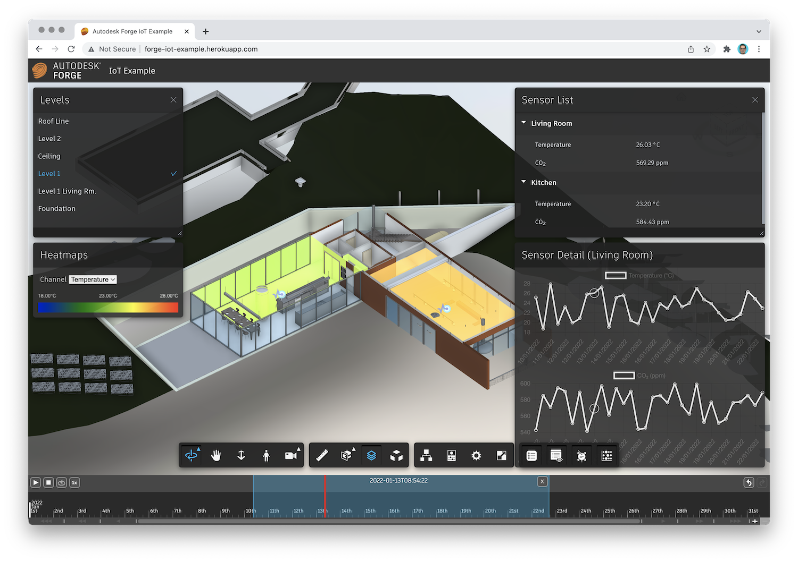

# forge-iot-extensions-demo-dotnet

Example [Autodesk Forge](https://forge.autodesk.com) application using
[Forge IoT Extensions](https://github.com/petrbroz/forge-iot-extensions) (a set of wrappers around the official
[Data Visualization Extensions](https://forge.autodesk.com/en/docs/dataviz/v1/developers_guide/introduction))
to display historical IoT data in a BIM model.

## Running locally

- Clone this repository
- Install dependencies: `dotnet restore`
- Setup environment variables:
    - `FORGE_CLIENT_ID` - client ID of your Forge application
    - `FORGE_CLIENT_SECRET` - client secret of your Forge application
- In [Autodesk/wwwroot/index.js](./Autodesk/wwwroot/index.js), modify `FORGE_MODEL_URN` and `FORGE_MODEL_VIEW`
with your own model URN and view GUID
- In [Autodesk/db.json](./Autodesk/db.json), modify the mocked up sensors,
for example, changing their `location` (XYZ position in the model's coordinate system)
or `objectId` (the dbID of the room the sensor should be associated with)

> Note: the locations and object IDs in the mocked up data is setup for the rac_basic_sample_project.rvt sample design.

- In [Autodesk/Libs/Utility.cs](./Autodesk/Libs/Utility.cs), adjust the resolution and ranges
of the randomly generated sensor data
- Run the app: `dotnet run --urls http://localhost:3000`
- Go to http://localhost:3000

## License

This sample is licensed under the terms of the [MIT License](http://opensource.org/licenses/MIT). Please see the [LICENSE](LICENSE) file for full details.

## Written by

Eason Kang [@yiskang](https://twitter.com/yiskang), [Forge Partner Development](http://forge.autodesk.com)

Petr Broz [@ipetrbroz](https://twitter.com/ipetrbroz), [Forge Partner Development](http://forge.autodesk.com)